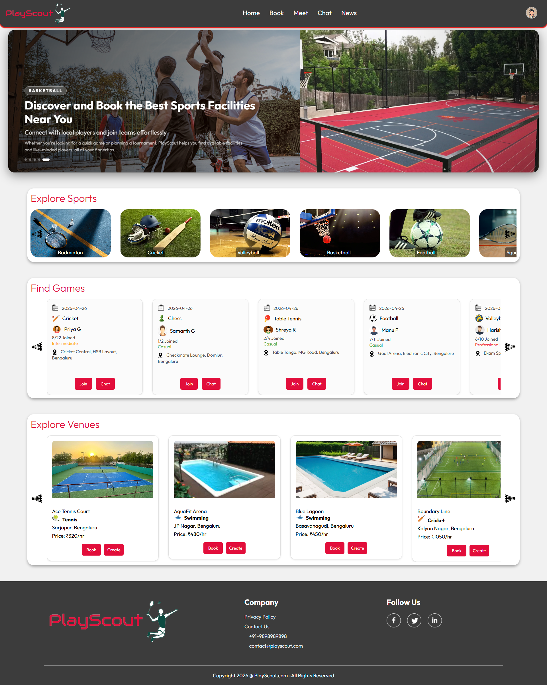

# PlayScout - Sports Facility Booking Platform

A full-stack web application that connects sports enthusiasts with venues, enabling them to book facilities, create games, find players, and manage bookings with real-time communication.

**Built with Spring Boot + React | Object-Oriented Analysis & Design Implementation**

---

## Home Page Preview



The screenshots of the rest of the pages are in the previews folder.

---

## Features

**Venue Management** - Browse sports venues with filters, view detailed information including facilities and images, and admin panel for managing venues.

**Booking System** - Check availability, book time slots flexibly, view booking history, and manage cancellations with automatic refund processing.

**Game Management** - Create games at venues with customizable details, set player limits, join existing games, and manage join requests.

**Real-Time Chat** - WebSocket-based messaging between game participants with instant notifications and message history.

**Player Discovery** - Explore other players in your area, view profiles and interests, and send join requests to games.

**Sports News Feed** - Stay updated with latest sports news integrated from external GNews API.

**Payment Integration** - Secure booking payments with payment history tracking and refund management.

**Authentication & Security** - User registration, JWT-based authentication, OAuth2 social login, and encrypted passwords.

---

## Tech Stack

### Backend
- **Framework**: Spring Boot 4.0.5
- **Language**: Java 25
- **Database**: Supabase (PostgreSQL)
- **Authentication**: Spring Security with JWT
- **Real-time**: WebSocket with STOMP

### Frontend
- **Framework**: React 19
- **Build Tool**: Vite
- **Styling**: CSS3
- **HTTP Client**: Axios
- **Real-time**: SockJS + STOMP Client

### Storage
- Supabase for database (PostgreSQL) and file storage integration

---

## Object-Oriented Design

PlayScout implements core OOPS patterns and principles for clean, maintainable code:

**Design Patterns** - Builder pattern for complex Booking objects, Factory for entity creation, Strategy for flexible validation and payment processing, Adapter for DTO conversions, and Command pattern for message handling.

**Core Principles** - Single Responsibility (each service handles one concern), Dependency Inversion (Spring DI throughout), Interface Segregation (separate DTOs for requests/responses), and Low Coupling (frontend and backend communicate through stable DTO contracts).

**Benefits** - Changes to internal models don't ripple to frontend, services are easy to test and extend, and code follows enterprise standards with clear separation between model, service, controller, and DTO layers.

---

## Installation & Setup

### Prerequisites
- **Java 25** or higher 
- **Node.js 18+** 
- **Supabase Account**
- **Maven 3.8+**
- **Git**

### Step 1: Clone the Repository

```
git clone https://github.com/yourusername/PlayScout-OOAD.git
cd PlayScout-OOAD
```

### Step 2: Database Setup (Supabase)

1. Create a Supabase account and project at [supabase.com](https://supabase.com)
2. In your Supabase dashboard, go to SQL Editor and create a new query
3. Copy the contents from `database/schema.sql` and execute it
4. Populate sample data from files in the `data/` directory (if needed)


### Step 3: Backend Setup

1. **Navigate to Backend Directory**
   ```
   cd backend
   ```

2. **Configure Environment**
   - Copy `.env.example` to `.env`
   - Fill in the values:
     - Database connection details from Supabase (host, user, password)
     - JWT secret for authentication
     - Stripe keys (if using payments)
     - OAuth credentials (if using social login)
     - Other service endpoints as needed

3. **Build and Run**
   ```
   .\mvn.cmd clean install
   .\mvn.cmd spring-boot:run
   ```
   
   The backend will start on `http://localhost:8080`

### Step 4: Frontend Setup

1. **Navigate to Frontend Directory**
   ```
   cd frontend
   ```

2. **Configure Environment**
   - Copy `.env.example` to `.env`
   - Fill in the values:
     - Backend URL 
     - Supabase storage URL
     - OAuth settings

3. **Install and Run**
   ```
   npm install
   npm run dev
   ```
   
   Frontend will be available at `http://localhost:5173/`
